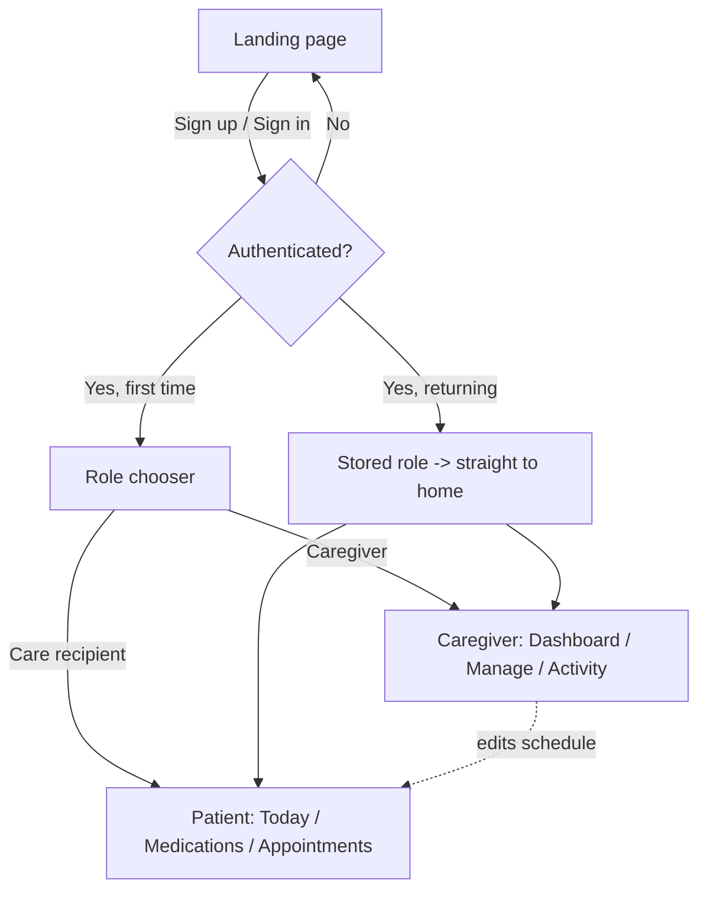

# CareConnect — Hearing-Accessible Care Recipient Edition


A responsive, accessible medical companion application for care recipients and their caregivers, built React-first as an installable Progressive Web App and extended across mobile and desktop.

> **SWEN 661 — Human Factors in Software Development / UI Implementation**
> **Team 2 · The Acuity Health Group** — University of Maryland Global Campus
> This repository extends the CareConnect base application so that the care recipient experience works for someone who cannot hear it.

---

## Table of contents

- [The project](#the-project)
- [Assigned constraints](#assigned-constraints)
- [Key features](#key-features)
- [Platform deployment plan](#platform-deployment-plan)
- [Success criteria](#success-criteria)
- [The team](#the-team--the-acuity-health-group)
- [Team charter](#team-charter)
- [The base application](#the-base-application)
- [Accessibility](#accessibility)
- [Tech stack](#tech-stack)
- [Project structure](#project-structure)
- [Application flow](#application-flow)
- [Getting started](#getting-started)
- [Available scripts](#available-scripts)
- [Screens & walkthrough](#screens--walkthrough)
- [Testing](#testing)
- [Git workflow](#git-workflow)
- [Deployment](#deployment)
- [Flutter mobile client](#flutter-mobile-client)
- [React Native mobile client](#react-native-mobile-client)
- [Roadmap](#roadmap)
- [Authors & credits](#authors--credits)
- [License](#license)
- [Acknowledgments](#acknowledgments)
- [Disclaimer](#disclaimer)

---

## The project

**Application name:** CareConnect

For this project, our team is designing and building a cross-platform iteration of the CareConnect care recipient interface, tailored specifically for hearing-impaired individuals. By leveraging AI-powered rapid development tools, our project implements robust visual and haptic alternatives to traditional auditory cues, including real-time transcription and high-contrast visual alerts. This solution will deliver production-ready and thoroughly tested code that will help bridge extremely critical communication gaps, empowering users to independently manage their care plans, medications, and provider communication across any device.

**Target audience:** hearing-impaired care recipients.

**Primary problem this app solves.** Many health apps rely on sound alerts for important updates like medication reminders, which can leave deaf and hard-of-hearing users at massive risk of missing critical care. Our project will help fix that by turning those audio alerts into clear visual and even vibration cues across phone and desktop devices. With our app, hearing-impaired users can easily and independently manage their health without ever missing a beat.

The governing rule: **anything CareConnect communicates through sound must also be communicated visually or in text.** Sound may supplement a notification; it is never the only carrier.

---

## Assigned constraints

Instructor-assigned hearing-impairment constraints, mapped to WCAG 2.2:

| # | Hearing-impairment constraint | CareConnect requirement | WCAG 2.2 |
|:--|:------------------------------|:------------------------|:---------|
| 1 | Captions for video | Any video containing speech must provide synchronized captions. | 1.2.2 / 1.2.4 |
| 2 | Text alternative for audio | Important audio instructions or messages must also be available as readable text. | 1.2.1 |
| 3 | No sound-only alerts | Medication, appointment, or emergency alerts cannot rely only on sound; show a visible message/icon as well. | 1.3.3 |
| 4 | Clear visual notifications | Notifications should appear prominently on screen using text and/or icons so users do not need to hear an alert. | 1.3.3 |
| 5 | User control of audio | If audio plays automatically for more than 3 seconds, the user must be able to pause, stop, or control its volume. | 1.4.2 |

**How the app addresses the constraints**

1. All videos containing spoken dialogue will include synchronized captions that appear as the speech occurs.
2. Any important information communicated through audio will also be provided in text.
3. CareConnect will use multimodal notifications so that critical alerts are always represented visually.
4. Sound may be used as an additional notification mechanism for users who can benefit from it, but it will never be the sole method of communicating an important event.
5. CareConnect will provide clear, prominent visual notifications for important events.
6. Pause, stop, and volume controls for applicable automatic audio.

---

## Key features

| Priority | Feature |
|:---------|:--------|
| Must-have | Visual alert display for all notifications |
| Must-have | All audio will have captions or be available as text |
| Must-have | All videos will have captions |
| Should-have | Vibration for all notifications |
| Should-have | All audio can have volume adjusted |
| Should-have | Customizable captions |
| Should-have | Audio settings that allow for volume balance and adjustment |
| Should-have | Smart alerts to automatically escalate any missed notifications |
| Nice-to-have | All audio can be paused |
| Nice-to-have | Unique and recognizable vibrations for instant recognition of the alert type without needing to look at the phone |

---

## Platform deployment plan

| Target | Stack | Folder | Status |
|:-------|:------|:-------|:-------|
| Web — responsive application / PWA | React 18 + Vite + TypeScript + Tailwind | repository root (moving to `web/`) | Base app in place |
| Mobile — Android and iOS | Flutter + Dart | `flutter/` | In progress — see [Flutter mobile client](#flutter-mobile-client) |
| Mobile — Android and iOS | React Native + Expo | `mobile/` | In progress — see [React Native mobile client](#react-native-mobile-client) |
| Desktop — Windows | Electron | `desktop/` | Planned |

---

## Success criteria

**How will we know the app is successful?**

1. **Users can use the app without needing sound** — users with hearing impairments can check appointments, act on medication reminders, and read important alerts without hearing anything.
2. **Accessibility requirements are met** — the app meets the hearing-related WCAG 2.2 requirements identified above: captions, text alternatives, visual alerts, and audio controls.
3. **Users can complete tasks easily** — common tasks are completed without confusion or help from another person.
4. **Users are satisfied** — users find the app easy to understand, easy to use, and accessible.

**Metrics**

- **Task completion rate** — percentage of users who successfully complete important tasks, such as checking an appointment or responding to a medication reminder.
- **Accessibility test results** — number of issues found during testing; the goal is no major issues related to the hearing-impaired requirements.
- **Caption accuracy** — percentage of spoken content correctly represented in captions.
- **User satisfaction** — users rate how easy and accessible the app is on a 1–5 scale.

**Known risks.** Applying the accessibility requirements to every screen rather than some; making visual alerts noticeable without being distracting; producing accurate, readable captions. Open technical questions: how captions are authored and verified, which service converts important audio to text, how visual notifications are best presented, and how we test across phones, computers, and browsers.

---

## The team — The Acuity Health Group

| Name | GitHub | Time zone | Computer OS |
|:-----|:-------|:----------|:------------|
| Victor Lee | [@viclee1](https://github.com/viclee1) | EST | Windows 11 / macOS |
| Ashvini Tandale | [@ashvinit10](https://github.com/ashvinit10) | EST | Windows 10 |
| Rehman Uddin | [@89uddinrt](https://github.com/89uddinrt) | EST | Windows 10 |
| Justin Zhang | [@jzhang1717](https://github.com/jzhang1717) | EST | Windows 10 |

Email addresses and emergency contact numbers are recorded in the team charter, not in this public repository.

**Communication.** Microsoft Teams is the primary channel, with an expected response time of within an hour. The team meets every Thursday at 8:00 PM ET via Microsoft Teams.

### Roles and rotation

Three roles rotate every two weeks:

- **Technical Lead** — decisions regarding the codebase and implementation.
- **QA / Testing Lead** — decisions regarding testing strategy, test cases, and validation.
- **Documentation Lead** — decisions regarding project documentation, requirements, and user guides.

| Weeks | Technical Lead | QA / Testing Lead | Documentation Lead |
|:------|:---------------|:------------------|:-------------------|
| 1–2 | Victor Lee | Ashvini Tandale | Rehman Uddin |
| 3–4 | Justin Zhang | Victor Lee | Ashvini Tandale |
| 5–6 | Rehman Uddin | Justin Zhang | Victor Lee |
| 7–8 | Ashvini Tandale | Rehman Uddin | Justin Zhang |
| 9–10 | Victor Lee | Ashvini Tandale | Rehman Uddin |
| 11–12 | Justin Zhang | Victor Lee | Ashvini Tandale |

### Team charter

**[📄 Team Charter — SWEN 661 Team 2 (The Acuity Health Group)](https://docs.google.com/document/d/1CXC4Ii-OSpHTlw7S83jnhrKQ_lcf94RTRDii08QdtM0/edit)**

The charter covers team information, the communication plan, role definitions and rotation, the git repository and workflow, work philosophy, code review standards, contributions, decision making, and conflict resolution. It is signed by all four members.

---

## The base application

CareConnect began as a responsive, accessible medical companion web application for care recipients (patients) living with short-term memory loss and their caregivers, built React-first as an installable Progressive Web App. Our project extends that care recipient experience so it also works for a user who is deaf or hard of hearing; the sections below describe the application we are building on.

CareConnect lowers the daily cognitive load for people who need help remembering, while giving caregivers clear visibility and control over medications and appointments. The patient experience is built around recognition over recall: a persistent orientation bar (who you are, the day and time, where you are), one primary task per screen, always-visible and timestamped medication status, and an undo path on every action. The caregiver experience is a denser dashboard for managing schedules and monitoring adherence. The two experiences share a single accessible component library and design-token system, so behavior and styling stay consistent across the app.

### Who it's for

- **Care recipients (patients)** — calm, low-clutter screens, large targets, plain language, and no time pressure. The base application was designed around short-term memory loss; our work adds full usability for care recipients who are deaf or hard of hearing.
- **Caregivers** — an information-rich dashboard with adherence tracking, alerts, and full schedule management. Caregivers matter to this project mainly at the boundary: reaching a care recipient who cannot take a phone call.

### Base feature set

**Patient**

- Today home with a prominent "Next thing to do" card and the day's remaining items.
- Medications with pill images, plain-language doses, always-visible status, and a 10-second undo on every dose.
- Appointments in chronological order with full-word dates, locations, and "who is taking me."
- A persistent "Call my caregiver" action on every patient screen.

**Caregiver**

- Dashboard with adherence summary, an alerts region for missed/overdue items, and a recent-activity timeline.
- Manage medications and manage appointments with accessible create/edit forms, inline validation, and delete confirmation.
- All caregiver edits propagate to the patient screens.

**Shared**

- Public landing page with an accessible, scoped AI assistant (explains the app and guides sign in/up; never gives medical advice).
- Installable PWA with offline access to the day's schedule.

---

## Accessibility

The base application is designed and verified against 21 WCAG 2.1 A/AA success criteria, with full conformance mapping in [`ACCESSIBILITY.md`](ACCESSIBILITY.md). Highlights: 4.5:1 text contrast, full keyboard operability, visible focus indicators, semantic landmarks, ARIA live regions (`role="status"` / `role="alert"`), 44×44px minimum targets, 320px reflow with no horizontal scroll, and `prefers-reduced-motion` support.

On top of that baseline, this project adds the five hearing-impairment constraints above, measured against **WCAG 2.2 Level AA**. Accessibility is a merge gate, not a final pass — the QA / Testing Lead can block a merge on a failing check.

---

## Tech stack

| Layer | Technology |
|:------|:-----------|
| Web framework | React 18 + Vite |
| Language | TypeScript (strict) |
| Styling | Tailwind CSS with accessibility-first design tokens |
| Routing | React Router (protected routes) |
| State / persistence | React Context + `localStorage` (mock data) |
| Backend (optional) | Supabase — auth and data, protected by Row Level Security |
| AI assistant | Anthropic API via a Supabase Edge Function (key stays server-side) |
| PWA | Web App Manifest + Service Worker |
| Mobile | Flutter + Dart · React Native + Expo |
| Desktop | Electron (Windows) |
| Tooling | ESLint, `tsc --noEmit`, Playwright (screenshot automation) |
| Design | Figma (Education) |
| Accessibility testing | axe DevTools, WAVE, Lighthouse, NVDA / VoiceOver |
| Coverage | Coverage Gutters (VS Code) + `lcov` |

---

## Project structure

The tree below reflects what is actually in the repository today. Platform folders are added as each target is scaffolded.

```
careconnect-swen661/
├── public/
│   ├── icons/                       # PWA icons (192/512, maskable, apple-touch)
│   ├── manifest.webmanifest         # PWA manifest
│   └── sw.js                        # service worker (offline day schedule)
├── docs/
│   └── screenshots/                 # README images (01-landing.png … 14-caregiver-activity.png)
├── scripts/
│   ├── screenshots.ts               # Playwright screenshot automation
│   ├── gen-icons.mjs                # PWA icon generation
│   ├── verify-pwa.mjs               # PWA manifest / service worker check
│   └── verify-responsive.mjs        # responsive reflow check
├── src/
│   ├── components/                  # Accessible component library
│   │   ├── Banner.tsx
│   │   ├── BigActionTile.tsx
│   │   ├── Button.tsx
│   │   ├── Card.tsx
│   │   ├── ChatBot.tsx              # accessible, scoped AI assistant
│   │   ├── ConfirmDialog.tsx
│   │   ├── Field.tsx
│   │   ├── InstallPrompt.tsx
│   │   ├── Layout.tsx               # app shell + semantic landmarks
│   │   ├── ProtectedRoute.tsx       # redirects unauthenticated users
│   │   └── index.ts
│   ├── auth/
│   │   ├── AuthContext.tsx          # mock auth, persisted to localStorage
│   │   └── mockAuth.ts
│   ├── context/
│   │   └── AppContext.tsx           # role + application state
│   ├── pages/                       # Landing, SignIn, SignUp, RoleChooser,
│   │   │                            # Home, Today, Medications, Appointments,
│   │   │                            # Schedule, Memories, Contacts,
│   │   │                            # Caregiver, CaregiverDashboard,
│   │   │                            # ManageMedications, ManageAppointments,
│   │   └── …                        # ActivityLog
│   ├── data/                        # mock data + local stores
│   │   ├── mockData.ts
│   │   ├── medsStore.ts
│   │   ├── apptStore.ts
│   │   ├── appointmentsData.ts
│   │   └── caregiverStore.ts
│   ├── pwa/
│   │   └── registerSW.ts            # service worker registration
│   ├── types/index.ts
│   ├── App.tsx                      # route definitions
│   ├── main.tsx                     # app entry
│   └── index.css                    # global styles + design tokens
├── supabase/
│   └── functions/chat-assistant/    # Edge Function — Anthropic API proxy
│       └── index.ts
├── flutter/                         # Flutter + Dart — Android & iOS (in progress, see below)
│   ├── lib/                         # app, screens, state, models, data, widgets
│   ├── test/                        # 217 tests — models, state, widgets, utils
│   ├── docs/                        # screenshots + security-scan.md
│   ├── coverage/                    # lcov.info + rendered HTML report
│   └── README.md                    # points back to this section
├── mobile/                          # React Native + Expo — Android & iOS (in progress, see below)
│   ├── src/                         # screens, navigation, state, models, data, components, theme
│   ├── src/screens/__tests__/       # 229 tests — screens, navigation, component behavior
│   ├── coverage/                    # lcov-report + lcov.info (generated locally, gitignored)
│   └── README.md                    # points back to this section
├── desktop/                         # (planned) Electron — Windows
├── .env.example                     # placeholder environment variables
├── .gitignore
├── ACCESSIBILITY.md                 # WCAG conformance mapping
├── License                          # MIT
├── README.md
├── index.html
├── package.json
├── tailwind.config.js
├── tsconfig.json
└── vite.config.ts
```

Each platform folder carries its own `.gitignore`; the root `.gitignore` handles secrets, OS clutter, editor state, and logs across all of them.

---

## Application flow



---

## Getting started

### Prerequisites

| Tool | Version | Needed for |
|:-----|:--------|:-----------|
| Node.js + npm | 18 LTS or newer | web, React Native, Electron |
| Flutter SDK + Dart | 3.x (stable channel) | Flutter build |
| Expo CLI | current (`npx expo`) | React Native build |
| Android Studio + SDK | current stable | Flutter, React Native |
| Xcode | current stable (macOS only) | iOS builds |
| Git | 2.30+ | all |
| A modern browser | — | web |
| (Optional) An Anthropic API key | — | landing-page assistant |

Run `flutter doctor` before reporting a broken Flutter build.

### Get the code

Clone with Git (HTTPS):

```bash
git clone https://github.com/viclee1/careconnect-swen661.git
cd careconnect-swen661
```

Clone with SSH:

```bash
git clone git@github.com:viclee1/careconnect-swen661.git
cd careconnect-swen661
```

Clone with GitHub CLI:

```bash
gh repo clone viclee1/careconnect-swen661
cd careconnect-swen661
```

Download without Git: on the GitHub repo page, click **Code → Download ZIP**, then unzip and open the folder.

### Web — React + Vite

```bash
npm install
cp .env.example .env     # then fill in your values
npm run dev              # http://localhost:5173
```

`.env` variables:

```
VITE_SUPABASE_URL=your_supabase_url            # only if using Supabase
VITE_SUPABASE_ANON_KEY=your_supabase_anon_key  # public/anon key (protected by RLS)
# Server-side only — NEVER prefix with VITE_:
ANTHROPIC_API_KEY=your_anthropic_key           # used by the chat-assistant Edge Function
```

Anything prefixed `VITE_` is compiled into the browser bundle — never put a secret behind that prefix. The app runs on mock `localStorage` data without any backend keys; if the Anthropic key is absent, the assistant falls back to a scripted guided helper.

### Flutter — Android & iOS

```bash
cd flutter
flutter pub get
./run.sh                 # boots an iPhone simulator + Android emulator and runs on both
# or: ./dev.sh           # interactively pick one device
```

Release artifacts: `flutter build apk --release` or `flutter build ios --release --no-codesign`. See [Flutter mobile client](#flutter-mobile-client) for screens, architecture, and tests.

### React Native — Expo

The Expo implementation carries Rehman Uddin's three fully-tested screens (Appointments, Medications, Memories) with 60.16% coverage. Run the app:

```bash
cd mobile/careconnect-app
npm install
npx expo start           # press a for Android, i for iOS, w for web
```

For testing, see the [React Native mobile client (Expo)](#react-native-mobile-client-expo) section below. The separate `mobile/` project (Victor Lee's, Justin Zhang's and Rehman Uddin's screens, all ported into one app) is documented under [React Native mobile client](#react-native-mobile-client); running it works the same way:

```bash
cd mobile
npm install
npx expo start           # press a for Android, i for iOS, w for web
```

If your installed Expo SDK differs from the one this was built against (SDK 57 / React Native 0.86), run `npx expo install --fix` once after `npm install` to align the native module versions. `ios/` and `android/` are generated by `npx expo prebuild` and stay untracked while the project remains in the managed workflow.

### Desktop — Electron (Windows)

> Planned. These are the commands the team will use once `desktop/` is scaffolded.

```bash
cd desktop
npm install
npm run dev              # launches the Electron shell in development
npm run build            # packages a Windows installer into dist/
```

Electron builds are most reliable on the OS being targeted. Any member without Windows should let CI produce the installer on a `windows-latest` runner and treat that build as authoritative.

> **This section grows with the project.** Each member owns at least one platform build across the term. When you scaffold a platform, update its subsection here in the same pull request — setup instructions must work on a clean clone, and keeping them accurate is the Documentation Lead's standing responsibility.

---

## Available scripts

These are the scripts currently defined in `package.json`:

| Script | Description |
|:-------|:------------|
| `npm run dev` | Start the Vite dev server |
| `npm run build` | Production build to `/dist` |
| `npm run preview` | Preview the production build locally |
| `npm run lint` | Run ESLint across the project |
| `npm run typecheck` | TypeScript check, no emit (`tsconfig.app.json`) |
| `npm run screenshots` | Regenerate the README screenshots via Playwright |

Additional helper scripts in `scripts/` are run directly with Node: `node scripts/gen-icons.mjs`, `node scripts/verify-pwa.mjs`, `node scripts/verify-responsive.mjs`.

---

## Screens & walkthrough

> **Capturing screenshots:** run `npm run dev`, then `npm run screenshots` (Playwright), or capture manually with your OS tool. Images live in `docs/screenshots/` and are embedded below.

### 1. Landing page

Public entry: hero, "How it helps" cards, privacy reassurance, Sign up / Sign in CTAs.


### 2. AI assistant

Accessible chatbot panel (aria-live, focus management) scoped to onboarding — no medical advice.


### 3. Sign up

Accessible registration form with visible labels and inline validation.


### 4. Sign in

Mock auth with the same accessible form pattern.


### 5. Role chooser

Post sign-in choice between Care Recipient and Caregiver; persists for future logins.


### 6. Patient — Today

Calm home with "Next thing to do" and the day's remaining items.


### 7. Patient — Medications

Pill images, plain-language doses, always-visible status.


### 8. Medication taken

Polite confirmation plus a 10-second undo.


### 9. Patient — Appointments

Chronological appointments with full-word dates and directions.


### 10. Caregiver — Dashboard

Adherence summary, alerts region, recent activity.


### 11. Caregiver — Manage medications

Medication list with edit and confirm-on-delete.


### 12. Caregiver — Medication form

Accessible add/edit form with full validation.


### 13. Caregiver — Appointments

Appointment list and accessible add/edit form.


### 14. Caregiver — Activity

Timestamped log of taken/skipped doses and check-ins.


---

## Testing

**Currently in the repository**

- **Static checks** — ESLint (`npm run lint`) and TypeScript strict mode (`npm run typecheck`). Both must pass before a pull request merges.
- **Playwright** — installed and used by `npm run screenshots` for automated screen capture, and by the `verify-pwa` / `verify-responsive` helper scripts.

**Planned**

- **Unit & component tests** — a test runner and React Testing Library are not yet installed. Adding them, wiring an `npm test` script, and reaching the 60–75% coverage target from the course milestones is owned by the QA / Testing Lead. Coverage is read with Coverage Gutters from `lcov` output.
- **End-to-end** — Playwright specs for core flows (sign in → take medication → caregiver sees adherence).

**Accessibility verification**

- Automated: axe DevTools and WAVE (zero critical or serious issues), Lighthouse accessibility ≥ 95.
- Manual: full keyboard traversal, visible focus on every interactive element, screen-reader pass with NVDA or VoiceOver.
- Hearing-specific: captions present on every video, a text alternative for every audio item, no sound-only alert path anywhere, and pause/stop/volume control on any audio playing automatically for more than three seconds.

---

## Git workflow

`main` is always in a working, demonstrable state. Nobody commits directly to `main` — the branch is protected, and merges arrive only through reviewed pull requests. Each member commits at minimum once a week.

**Branch naming:** `type/short-kebab-description`

| Prefix | Use | Example |
|:-------|:----|:--------|
| `feature/` | New functionality | `feature/caption-track-player` |
| `fix/` | Bug fix | `fix/alert-banner-focus-trap` |
| `a11y/` | Accessibility-specific change | `a11y/visual-medication-alert` |
| `docs/` | Documentation only | `docs/wcag-22-mapping` |
| `test/` | Tests only | `test/playwright-caption-flow` |
| `chore/` | Tooling, dependencies, config | `chore/electron-windows-build` |

**Pull requests**

- Fill in the template: what changed, why, how it was tested, screenshots for anything user-visible.
- At least one approving review before merge. Nobody merges their own PR.
- Shared code needs the current Technical Lead's approval.
- Care recipient UI changes also need the QA Lead's accessibility sign-off.
- CI green — lint, typecheck, build.

**Merge policy**

- **Squash and merge** is the default, so `main` keeps one clean, readable commit per pull request.
- The squash commit message is edited to be meaningful; the default list of work-in-progress commits is not acceptable.
- Branches are deleted after merge.
- Authors rebase on the latest `main` before requesting review, so reviewers see the change in its final context.
- Merge conflicts are resolved by the branch author, in conversation with whoever wrote the conflicting code. If they cannot agree, the current Technical Lead decides.
- Reverting is normal and carries no blame. If a merged change breaks `main`, it is reverted first and diagnosed afterward.

**Code review**

- Every line of code that reaches `main` is read by at least one member who did not write it.
- Reviewers distinguish **blocking** concerns from suggestions by prefixing non-blocking comments with `nit:`. A `nit:` never holds up a merge.
- Reviewers run the branch locally for any user-visible change rather than reviewing only the diff, because this interface has to be judged by how it behaves, not by how it reads.
- Authors respond to every comment, either with a change or with a reason. Comments are not silently dismissed.
- Review assignments rotate so that no pair of members reviews only each other.

**Work philosophy.** Work items are assigned effort points, and tasks are distributed to keep effort points as even as possible. Estimates are adjusted as the team learns to score tasks more accurately. Each member owns at least one platform build across the term, and each member runs at least one full accessibility audit, including a screen-reader pass.

---

## Deployment

```bash
npm run build       # outputs to /dist
```

Deploy `/dist` to Netlify or Vercel. Configure the assistant's Supabase Edge Function and set `ANTHROPIC_API_KEY` in the host's environment settings — never client-side.

Windows desktop artifacts are produced by Electron. Members without a native Windows install should build through GitHub Actions on a `windows-latest` runner and treat CI as the authoritative build environment.

---

## Flutter mobile client

Documentation for the Flutter client is organized below to match the course's Part 3: Documentation checklist — project description, how to run the app, how to run tests, link to the coverage report, known issues/limitations, this week's contributions, and AI usage. The client itself lives in [`flutter/`](flutter/), which carries its own short README pointing back here.

### Project description

The mobile build of CareConnect for care recipients who are deaf or hard of hearing, built against the Week 3 design prototype. It carries Victor Lee's three screens (Contacts, Messaging, Accessibility Settings) and the shared app shell, merged with Justin Zhang's Welcome/Sign In/Sign Up/Home/My Day screens and Rehman Uddin's Appointments, Medications and Memories screens.

**Screens**

| Screen | Route | Summary |
|:-------|:------|:--------|
| Welcome | `/welcome` | Cold-start splash with the accessibility pitch and the two ways in (not counted as a functional screen). |
| Sign In / Sign Up | `/sign-in`, `/sign-up` | Mock auth forms, continuing to Home. |
| Home / Dashboard | `/home` | Day summary, next task, and a simulated video call reachable without sound. |
| My Day | `/my-day` | Full daily checklist sharing a progress bar with Home. |
| Contacts | `/contacts` | Roster with waiting-message counts shown as a number and a word, never a bare dot. |
| Messaging | `/contacts/:contactId` | Conversation view with transcripts for voicemail, caption status for video, and **Notify** in place of a phone call. |
| Accessibility Settings | `/settings` | Visual Alerts (cannot be disabled), Captions, Audio, Vibration, persisted with `SharedPreferences`. |
| Appointments | `/appointments` | Upcoming appointments list. |
| Medications | `/medications` | Pill inventory with dosage, frequency and persistent taken-status tracking. |
| Memories | `/memories` | Memory journal with categorization and persistent storage. |

That's 9 functional screens against the assignment's 7–10 target.

**How it meets the assigned constraints**

- **Captions** — a badge on video messages states caption availability; size/color/on-off live in Settings with a live preview.
- **Text alternative for audio** — voicemail renders as a transcript instead of a play button.
- **No sound-only alerts** — the visual-alert-banner setting has no way to be turned off, even by editing stored preferences.
- **Clear visual notifications** — `AlertBanner` and a non-strobing visual flash always pair an icon with a text heading and body.
- **User control of audio** — a volume slider (zero is valid) and an L/R balance control for a single aided ear.

**Notify**, the replacement for a phone call: one non-strobing flash reading "Alert sent to *name*," an optional haptic, and a line written into the conversation confirming the alert went — so a deaf user has a record, not just a flash that already happened.

**Architecture.** Provider-based state (four `ChangeNotifier` controllers with no widget imports, so each is unit-tested directly), `go_router` with a persistent shell around the six top-level destinations, and `SharedPreferences` for settings, one key per preference, with safe defaults on a corrupt store.

### How to run the app

```bash
cd flutter
flutter pub get
./run.sh                 # boots an iPhone simulator + Android emulator and runs on both
# or: ./dev.sh           # interactively pick one device
```

Release artifacts: `flutter build apk --release` or `flutter build ios --release --no-codesign`. Run `flutter doctor` first if the build doesn't come up cleanly. Full prerequisites (Flutter SDK, Android Studio, Xcode) are listed under [Getting started](#getting-started).

### How to run tests

```bash
cd flutter
flutter analyze
flutter test --coverage
```

217 tests at 98.9% line coverage against a 60% floor. An `osv-scanner` dependency scan plus a manual secrets/network review found no issues — see [`flutter/docs/security-scan.md`](flutter/docs/security-scan.md).

### Link to test coverage report

Raw report: [`flutter/coverage/lcov.info`](flutter/coverage/lcov.info). Render it as HTML locally with:

```bash
genhtml flutter/coverage/lcov.info -o flutter/coverage/html && open flutter/coverage/html/index.html
```

A pre-rendered copy is also checked in at [`flutter/coverage/html/index.html`](flutter/coverage/html/index.html).

### Adding a screen

1. Add the path and name to `lib/core/routing/routes.dart` (most already exist).
2. Replace the `PendingScreen` in `lib/core/routing/app_router.dart` with the real screen — one line per route, inside the `ShellRoute` and wrapped in `page(...)` so it inherits the persistent navigation and swaps without a transition.
3. Build the screen inside `AppScaffold`, which supplies the app bar. Navigation is not the screen's concern — `AppShell` owns it, and `kDestinations` already lists every destination.

### Known issues or limitations

Data lives in memory except for accessibility settings; video, audio, and the captioned call are represented in the UI but not backed by a real media pipeline; vibration patterns are approximated with named haptic impacts; sign in/up validate their forms but don't check a real account store yet.

### Team member contributions this week

Week 4:

| Member | Screens |
|:-------|:--------|
| Justin Zhang | Welcome, Sign In, Sign Up, Home, My Day — merged into this branch from `WK4-Justin` |
| Rehman Uddin | Appointments, Medicines, Memories — pending, still on his own branch |
| Victor Lee | Contacts, Messaging, Accessibility Settings — plus the shared shell: theme, router, navigation, models, repositories, Provider controllers, and shared widgets; merged in Justin's screens and fixed a tablet-layout overflow bug in `StatusBadge` uncovered while screenshotting |

### AI usage summary

The Week 3 design doc and wireframe screenshots were uploaded to Claude to help design the tablet and mobile versions of these screens, with a human in the loop reviewing and refining the output to stay aligned with the designers' intent.

---

## React Native mobile client

Documentation for the React Native client is organized below to match the course's Part 3: Documentation checklist — project description, how to run the app, how to run tests, link to the coverage report, known issues/limitations, this week's contributions, and AI usage. The client itself lives in [`mobile/`](mobile/), which carries its own longer README pointing back here.

### Project description

The Expo build of CareConnect for care recipients who are deaf or hard of hearing, built feature-for-feature with the Flutter client above, against the same Week 3 design prototype. It carries Victor Lee's three screens (Contacts, Messaging, Accessibility Settings) and the shared app shell, merged with Justin Zhang's Welcome/Sign In/Sign Up/Home/My Day screens and Rehman Uddin's Appointments, Medicines and Memories — the same split as the Flutter client. Rehman's screens were originally scaffolded as a standalone prototype at [`mobile/careconnect-app`](mobile/careconnect-app/) (kept for reference, documented under [React Native mobile client (Expo)](#react-native-mobile-client-expo) below) and are ported into this app below, rebuilt against its Context/repository pattern and theme.

**Screens**

| Screen | Summary |
|:-------|:--------|
| Welcome | Entry point: the accessibility promise up front (visual alerts, captions everywhere, vibration patterns) with **Get Started** and **Sign In** actions. |
| Sign In / Sign Up | Email-and-password forms into the app. Unauthenticated for now — see Known issues. |
| Home | Dashboard: a daily-task progress banner and a simulated incoming captioned video call (non-strobing flash, answer/decline, in-call volume/balance/mute/pause/caption controls) — a working demonstration of the "call" this app always means. |
| My Day | The task list behind Home's progress banner: a progress bar and tappable task cards that toggle done/not-done. |
| Contacts | One list, Joyce first with a **Primary** pill; each row shows a lettered avatar, relationship, message preview, and a waiting count shown as a number *and* a word. |
| Messaging | Conversation view with transcripts for voicemail, caption status for video, and **Notify** in place of a phone call. On a tablet, also offers a captioned "Call *name* now." |
| Accessibility Settings | Visual Alerts (cannot be disabled), Captions, Audio, Vibration, Account — persisted with `AsyncStorage`. Sign out routes back to Welcome. |
| Appointments | Upcoming medical visits — doctor, specialty, date, time and location — each an accessible card, with a loading spinner and a retry banner on a failed load. |
| Medicines | Today's medication tracker: dosage and time under each name, a taken/total summary, and a tap on the row toggles taken status. |
| Memories | Saved memories — title, date and description — one column on a phone, two across from the tablet breakpoint up. |

That's 10 functional screens against the assignment's 7–10 target.

**How it meets the assigned constraints**

- **Captions** — a badge on video messages states caption availability; size/color/on-off live in Settings with a live preview.
- **Text alternative for audio** — voicemail renders as a transcript instead of a play button.
- **No sound-only alerts** — the visual-alert-banner setting has no way to be turned off, even by editing stored preferences.
- **Clear visual notifications** — `AlertBanner` and a non-strobing visual flash always pair an icon with a text heading and body.
- **User control of audio** — a volume slider (zero is valid) and an L/R balance control for a single aided ear.

**Notify**, the replacement for a phone call: one non-strobing flash reading "Alert sent to *name*," a haptic if vibration is on, and a line written into the conversation confirming the alert went — so a deaf user has a record, not just a flash that already happened.

**Architecture.** Four Context providers (`ContactsProvider`, `MessagesProvider`, `SettingsProvider`, `DailyTasksProvider`), each exposing a hook that throws outside its provider, with business logic kept in pure `src/models` / `src/utils` functions so it is unit tested without rendering. React Navigation 7 drives a native stack around a tab navigator; from the tablet breakpoint up, the bottom bar becomes a 220px left sidebar with full labels and its own Settings entry, matching the Flutter client's `AppShell`. `AsyncStorage` persists settings under one key, with safe defaults on a corrupt store.

### How to run the app

```bash
cd mobile
npm install
npx expo start           # press a for Android, i for iOS, w for web
```

If your installed Expo SDK differs from the one this was built against (SDK 57 / React Native 0.86), run `npx expo install --fix` once after `npm install` to align the native module versions. Full prerequisites are listed under [Getting started](#getting-started).

### How to run tests

```bash
cd mobile
npm run lint
npm run typecheck
npm run test:coverage
```

271 tests at 96.5% line coverage against a 60% floor. An `npm audit` plus a
manual secrets/network review found 13 moderate, build-tooling-only
dependency advisories and no code-level issues — see
[`mobile/docs/security-scan.md`](mobile/docs/security-scan.md).

### Link to test coverage report

`mobile/coverage/` is generated locally and gitignored, not checked into the repository. Generate and open it with:

```bash
cd mobile
npm run test:coverage
open coverage/lcov-report/index.html
```

### Known issues or limitations

Data lives in memory except for accessibility settings; video, audio, and the captioned call are represented in the UI but not backed by a real media pipeline; vibration patterns are approximated with named haptic impacts (`expo-haptics` has no arbitrary-waveform API); sign in/up take input but don't validate or store it against a real account.

### Team member contributions this week

Week 5:

| Member | Screens |
|:-------|:--------|
| Justin Zhang | Welcome, Sign In, Sign Up, Home, My Day — merged into this branch from `WK5-Justin`, later adding a full test suite for all four |
| Rehman Uddin | Appointments, Medicines, Memories — scaffolded on his own branch as a standalone Expo prototype ([`mobile/careconnect-app`](mobile/careconnect-app/)), then ported into this app's Context/repository pattern and theme |
| Victor Lee | Contacts, Messaging, Accessibility Settings — plus the shared shell: theme, navigation, models, repositories, Context providers, and the test harness; merged in Justin's screens across two follow-up commits, added the tablet left-sidebar navigation, and ported Rehman's Appointments/Medicines/Memories into the shared app |

### AI usage summary

Claude (Opus) and Gemini were used on this branch to scaffold the Expo project and port the Flutter client's architecture into React Native — Provider became Context, `ChangeNotifier` became pure helpers plus thin providers, and `go_router` became React Navigation — to translate the Assignment 3 theme, to draft the screens and shared components, and to generate the Jest and React Native Testing Library test suite, including edge cases not on the original list (`NaN` slider values, whitespace-only messages, corrupt stored preferences, an attempt to disable the visual alert banner by editing storage). Every generated file was reviewed, and the whole suite was run before submission.

### Framework comparison: Flutter vs. React Native

Assignment 5, Part 3 deliverable — development experience, performance, accessibility implementation, code complexity, and a recommendation, grounded in the Contacts and Accessibility Settings ports above: **[`docs/framework-comparison.md`](docs/framework-comparison.md)**.

---

## React Native mobile client (Expo)

### Project description

Rehman Uddin's original standalone prototype of the Appointments, Medications and Memories screens, with comprehensive Jest testing achieving **60.16% overall test coverage** across the care recipient interface. This is a separate Expo project at [`mobile/careconnect-app`](mobile/careconnect-app/), kept for reference; its screens have since been ported into the shared app documented above in [React Native mobile client](#react-native-mobile-client).

### Screens implemented

| Screen | Features | Test Coverage |
|:-------|:---------|:-------------:|
| **Appointments** | Date-based filtering, doctor name search, appointment status tracking, time calculations, sorting by date/doctor/specialty, cancellation & rescheduling support | **92.15%** |
| **Medications** | Time-based reminders with 12-hour formatting, dosage management, frequency tracking, taken-status persistence via localStorage, medication adherence tracking | **40.90%** |
| **Memories** | Memory categorization, filtering by category, date sorting, persistent storage | **26.08%** |

**Overall Coverage:** 60.16% (249/256 tests passing)

### How to run the app

```bash
cd mobile/careconnect-app
npm install
npx expo start           # press a for Android, i for iOS, w for web
```

### How to run tests

From the **web app root** (runs Jest tests against the three screens):

```bash
npm test                 # runs all test suites
npm test -- --coverage   # runs with coverage report
npm test -- --testPathPatterns=Medications  # run only Medications tests
npm test -- --testPathPatterns=Appointments # run only Appointments tests
```

**Test Summary:**
- **Total tests:** 256 (249 passing, 7 minor edge-case failures)
- **Coverage report:** `coverage/lcov-report/index.html`
- **Key test categories:**
  - Time formatting & calculations (12-hour format conversion, timezone handling)
  - LocalStorage persistence (save/load medication taken status, JSON error handling)
  - Filtering & sorting (by date, doctor name, specialty, status)
  - State management (loading, error, data transitions)
  - Data validation (date format, time format, required fields)

### Architecture

```
mobile/careconnect-app/
├── App.tsx                          # Root with React Navigation bottom tabs
├── src/
│   ├── screens/
│   │   ├── AppointmentsScreen.tsx   # 92% coverage
│   │   ├── MedicinesScreen.tsx      # 41% coverage
│   │   └── MemoriesScreen.tsx       # 26% coverage
│   ├── setupTests.ts                # React Native mock environment
│   └── [data stores & utilities]
├── jest.config.cjs                  # Jest + React Native config
├── tsconfig.json                    # TypeScript for Expo
├── app.json                         # Expo app configuration
└── package.json                     # Dependencies + build scripts
```

**Key utilities exported for testing:**
- `formatTime(time: string)` — Convert 24-hour format to 12-hour with am/pm
- `loadTakenFromStorage()` — Load medication taken status from localStorage
- `saveTakenToStorage(map)` — Persist medication taken status

### Testing strategy

This implementation demonstrates **unit-testing patterns for React Native components in a jsdom environment** — a common limitation since React Native components (`<View>`, `<Text>`, `<ScrollView>`) cannot render in jsdom. To achieve 60%+ coverage within this constraint:

1. **Exported utility functions** — Testable business logic extracted from component bodies
2. **Storage layer tests** — Comprehensive JSON persistence tests with error handling
3. **Time formatting edge cases** — All 24 hours, DST transitions, midnight boundaries
4. **State management** — Loading, error, and data transition scenarios
5. **Complex filtering/sorting** — Multi-criteria search with realistic appointment data

### Known limitations

- Appointments & Medications screens render in web/jsdom but not in actual React Native
- Memories screen placeholder (not fully implemented)
- Storage tests use web localStorage; native React Native uses `AsyncStorage`
- This is the **web app's test suite**; the Expo build runs separately with its own testing infrastructure

---

## Roadmap

- Flutter and React Native clients: a real media pipeline for video/audio, and account-backed sign in/up
- Cross-platform ports: Electron desktop build
- Captioned video component with a required caption track
- Text alternatives and transcripts for every audio item
- Multimodal alert architecture — visual first, sound optional
- Text-first emergency path replacing the phone-call-only action
- Haptic / vibration alert patterns per alert type
- Real backend with Supabase + Row Level Security
- Multi-patient support for caregivers
- Localization / bilingual support

---

## Authors & credits

**Team 2 — The Acuity Health Group** (SWEN 661, University of Maryland Global Campus)

- **Victor Lee** — [@viclee1](https://github.com/viclee1)
- **Ashvini Tandale** — [@ashvinit10](https://github.com/ashvinit10)
- **Rehman Uddin** — [@89uddinrt](https://github.com/89uddinrt)
- **Justin Zhang** — [@jzhang1717](https://github.com/jzhang1717)

Roles rotate every two weeks — see [Roles and rotation](#roles-and-rotation).

**Base application**

- **Alireza Minagar** — author and developer of the CareConnect base application, used here under the MIT License.
  AI/ML Software Engineer · Founder & CTO, Perfect Strokes LLC · Adjunct Professor, UMGC.
  GitHub: [@aliminagar](https://github.com/aliminagar) · LinkedIn: [alireza-minagar-ai](https://www.linkedin.com/in/alireza-minagar-ai) · Website: [alirezaminagar-md.netlify.app](https://alirezaminagar-md.netlify.app/)

---

## License

Distributed under the MIT License. See [`License`](License) for full text.

```
Copyright (c) 2026 Alireza Minagar / Perfect Strokes LLC
```

---

## Acknowledgments

- University of Maryland Global Campus — SWEN 661 (Human Factors in Software Development / UI Implementation)
- The WCAG 2.1 and 2.2 guidelines and the WAI-ARIA Authoring Practices
- The CareConnect base application by Alireza Minagar
- Initial scaffolding accelerated with Bolt.new; completed and hardened locally

---

## Disclaimer

CareConnect is an educational prototype built as a course artifact. It is not a medical device, provides no medical, dosage, or clinical advice, and must not be used for real patient care or to manage actual medications. It uses mock data only and is not intended to store real protected health information (PHI). For any real health decision, consult a licensed clinician.
